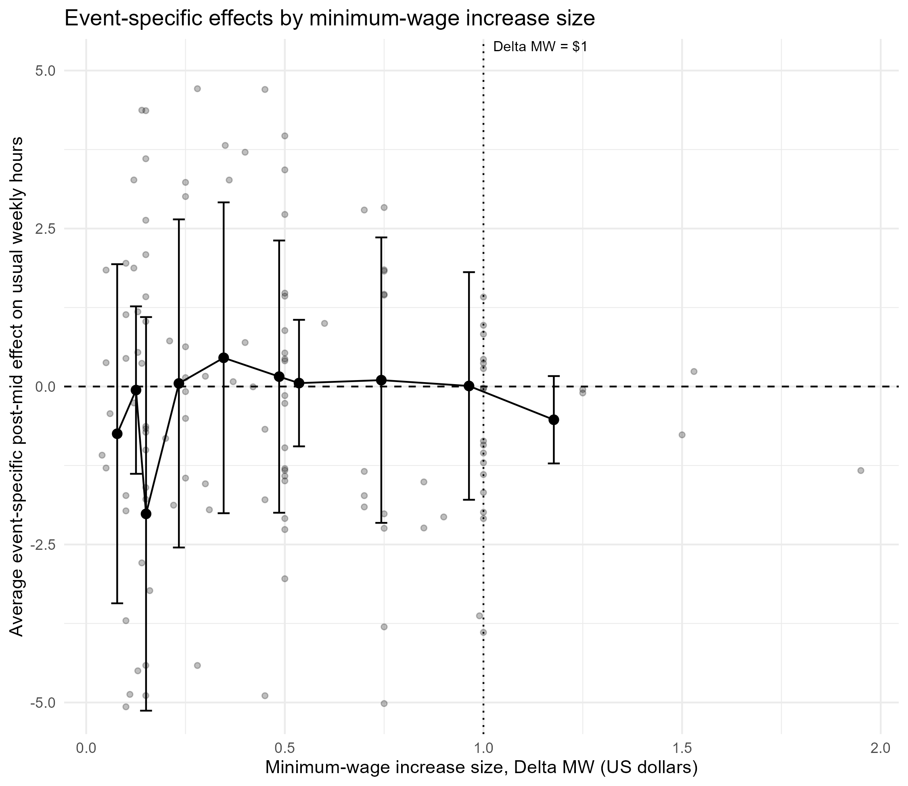

# Minimum Wages and the Intensive Margin

This repository contains the code, intermediate outputs, and paper files for a capstone project studying whether state minimum wage increases affect usual weekly hours worked among hourly workers in the United States.

Using CPS ORG microdata from IPUMS CPS and a stacked event-study design, the project builds event-level treatment windows around state minimum wage increases between 2010 and 2019. The analysis compares workers whose pre-policy wages fall near the relevant minimum wage threshold with higher-paid comparison workers in the same event window. The main results suggest little evidence of immediate hours adjustments and only modest medium-run reductions in hours among workers most exposed to the policy change.

## Repository Structure

- `R/`
  - Quarto files for data construction, estimation, robustness checks, and paper assembly.
- `data/raw/`
  - Raw input files used in the project.
- `data/processed/`
  - Intermediate `.rds` files created by the data-cleaning and estimation scripts.
- `tables/`
  - Output figures and tables used in the paper.

## Main Files

- `R/01_Data Clean.qmd`
  - Reads the raw CPS and minimum-wage data.
  - Builds the monthly minimum-wage panel.
  - Identifies minimum wage increase events.
  - Constructs the stacked state-month and stacked micro datasets.
  - Writes the main intermediate `.rds` files to `data/processed/`.

- `R/02_Main estimations.qmd`
  - Reads the processed files from Step 1.
  - Constructs the main treatment indicators, including the baseline `bound` and tolerance-band `bound_eps` measures.
  - Creates the final estimation sample `dat_main_eps.rds`.
  - Runs the baseline event-study, binned specifications, clustering checks, dose-response analysis, and policy-intensity heterogeneity specifications.
  - Saves main result figures and tables to `tables/`.

- `R/02.5_Summary Stats.qmd`
  - Reads `data/processed/dat_main_eps.rds`.
  - Produces final sample counts, summary statistics, and descriptive wage-distribution figures.
  - Writes outputs to `tables/`.

- `R/03_Robustness.qmd`
  - Runs robustness checks using alternative bound definitions and control sets.
  - Produces appendix support tables and robustness figures.

- `R/Capstone_paper_yanbiyue_A69032912.qmd`
  - Assembles the final paper using the saved outputs in `tables/`.

## Recommended Run Order

To reproduce the project from scratch, run the files in the following order:

1. `R/01_Data Clean.qmd`
2. `R/02_Main estimations.qmd`
3. `R/02.5_Summary Stats.qmd`
4. `R/03_Robustness.qmd`
5. `R/Capstone_paper_yanbiyue_A69032912.qmd`

## Why `02.5` Comes After `02`

The numbering is slightly awkward, but the dependency order is intentional.

`02.5_Summary Stats.qmd` uses `data/processed/dat_main_eps.rds`, which is created in `02_Main estimations.qmd`. So although summary statistics are conceptually descriptive, they are based on the final estimation sample rather than the earlier raw sample. For that reason, `02.5` must be run after `02`.

## Key Intermediate Files

Created in `01_Data Clean.qmd`:

- `mw_panel.rds`
- `stacked_state_month_clean.rds`
- `stacked_micro_clean.rds`
- `dat_main0.rds`
- `dat_cell_near.rds`

Created in `02_Main estimations.qmd`:

- `dat_bound2.rds`
- `dat_bound2b.rds`
- `dat_main_eps.rds`

## Data Access

The CPS data used in this project come from [IPUMS CPS](https://cps.ipums.org/cps/), where registered users can create and download extracts directly. The minimum wage panel used here is based on the historical state minimum wage dataset from Vaghul and Zipperer (2019): [Historical state and sub-state minimum wages, Version 1.2.0](https://github.com/benzipperer/historicalminwage/releases/tag/v1.2.0).

The raw CPS extract is not included in this public repository because the file is large and can be recreated directly from IPUMS. To reproduce the full pipeline, place the required raw files in `data/raw/` before running the scripts.

Expected raw inputs:

- `data/raw/cps_00001.csv.gz`
- `data/raw/mw_state_monthly.xlsx`

Suggested data citation:

Vaghul, K., & Zipperer, B. (2019). *Historical state and sub-state minimum wages* (Version 1.2.0) [Data set]. [https://github.com/benzipperer/historicalminwage/releases/tag/v1.2.0](https://github.com/benzipperer/historicalminwage/releases/tag/v1.2.0)

## Reproducibility Notes

- Open the project from `Capstone Paper.Rproj` so that `here()` resolves file paths correctly.
- Most outputs used in the paper are generated into `tables/` and then imported into the final paper `.qmd`.
- The final paper can be rendered after the analysis scripts have generated the required tables and figures.
